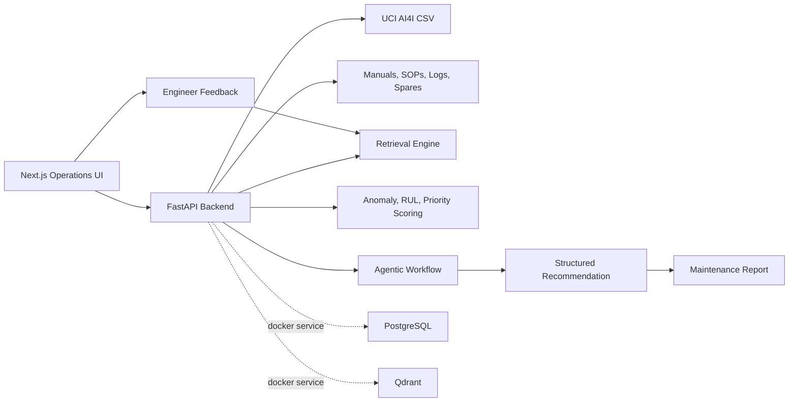

# SteelGuard AI Maintenance Wizard

SteelGuard AI is a local hackathon prototype for steel plant maintenance teams. It turns public predictive-maintenance telemetry, manuals, SOPs, maintenance logs, spare inventory, and engineer feedback into explainable maintenance decisions.

The telemetry backbone uses the UCI AI4I 2020 Predictive Maintenance Dataset. AI4I has 10,000 rows with air/process temperature, rotational speed, torque, tool wear, failure labels, and five failure modes. SteelGuard maps those real dataset fields into steel-plant asset signals such as motor vibration/current, pump pressure/flow, and gearbox oil contamination.

## What Is Implemented

- FastAPI backend with the requested public interfaces:
  - `POST /ingest/documents`
  - `POST /ingest/logs`
  - `POST /ingest/sensor-batch`
  - `GET /equipment`
  - `GET /equipment/{id}/health`
  - `GET /alerts`
  - `POST /chat`
  - `POST /recommendations`
  - `POST /feedback`
  - `POST /reports`
- Seeded steel plant assets:
  - Rolling Mill Stand 2 Drive Motor
  - Blast Furnace Cooling Pump P-7
  - Raw Material Conveyor Gearbox
- Agent-style workflow:
  - Triage
  - Evidence retrieval
  - Anomaly and RUL scoring
  - Risk and urgency prioritization
  - Maintenance action planning
  - Report-ready structured output
- Next.js dashboard:
  - Plant health summary
  - Live AI4I stream controls
  - Steel process digital twin strip
  - Equipment ranking
  - Alert list
  - Sensor trend chart
  - Maintenance Wizard chat
  - Evidence-backed recommendations
  - Report preview and copy action
  - Feedback buttons for accepted/corrected recommendations

## Architecture



The prototype uses deterministic scoring and local lexical retrieval so it runs without API keys. The Docker Compose file includes PostgreSQL and Qdrant to show the intended production path for persisted cases and vector search.

## Data Preparation

The backend downloads AI4I from UCI on first startup if `backend/data/ai4i2020.csv` is not present. You can prepare it explicitly:

```powershell
cd C:\Users\Mohd Aftaab\Downloads\169df72b552611f1\steelguard-ai\backend
python scripts\prepare_data.py
```

## Run Locally

Backend:

```powershell
cd C:\Users\Mohd Aftaab\Downloads\169df72b552611f1\steelguard-ai\backend
python -m venv .venv
.\.venv\Scripts\Activate.ps1
python -m pip install -r requirements.txt
python -m uvicorn app.main:app --reload --port 8000
```

Frontend:

```powershell
cd C:\Users\Mohd Aftaab\Downloads\169df72b552611f1\steelguard-ai\frontend
npm install
npm run dev
```

Open [http://localhost:3000](http://localhost:3000).

OpenAI setup:

- Copy `.env.example` to `.env` at the project root.
- Keep `OPENAI_API_KEY` in that root `.env`; the backend reads it directly.
- RAG uses `OPENAI_EMBEDDING_MODEL` when present, or `text-embedding-3-small` by default.
- See [docs/openai_rag_setup.md](docs/openai_rag_setup.md) for the health check fields and offline fallback.

## Docker Submission Flow

Docker is not installed on this machine, but the project includes a Docker Compose setup for environments that have Docker Desktop:

```powershell
cd C:\Users\Mohd Aftaab\Downloads\169df72b552611f1\steelguard-ai
docker compose up --build
```

Then open [http://localhost:3000](http://localhost:3000).

## Demo Script

1. Open the dashboard and show the critical rolling mill motor alert.
2. Point to the UCI AI4I row count, failure rows, and live stream step.
3. Select the Rolling Mill Stand 2 Drive Motor.
4. Point to the sensor trend: temperature, vibration, current, torque, tool wear, and delay are mapped from AI4I rows.
5. Show the recommendation panel:
   - Diagnosis
   - Probable root causes
   - Immediate maintenance actions
   - Spare strategy
   - Evidence from manual, SOP, failure report, and historical maintenance log
6. Ask the chat: `What should we do before the next rolling pass?`
7. Generate the maintenance decision report.
8. Click `Accept` or `Correct` to show the feedback loop.

## Test Commands

Backend:

```powershell
cd C:\Users\Mohd Aftaab\Downloads\169df72b552611f1\steelguard-ai\backend
pytest
```

Frontend:

```powershell
cd C:\Users\Mohd Aftaab\Downloads\169df72b552611f1\steelguard-ai\frontend
npm run build
```

## Assumptions And Limits

- Sensor data uses UCI AI4I rows and maps them into steel-plant equipment signals for demo purposes.
- RUL uses a transparent degradation-index baseline, not a certified reliability model.
- Retrieval ranks manuals, SOPs, failure reports, logs, feedback, and external guidance with OpenAI embeddings when `OPENAI_API_KEY` is available. It falls back to a local vectorizer only for offline runs.
- OpenAI response generation is used by the maintenance copilot when the API key is configured; otherwise the backend returns a structured fallback recommendation.

## Data Source

- UCI Machine Learning Repository: AI4I 2020 Predictive Maintenance Dataset, DOI `10.24432/C5HS5C`.
